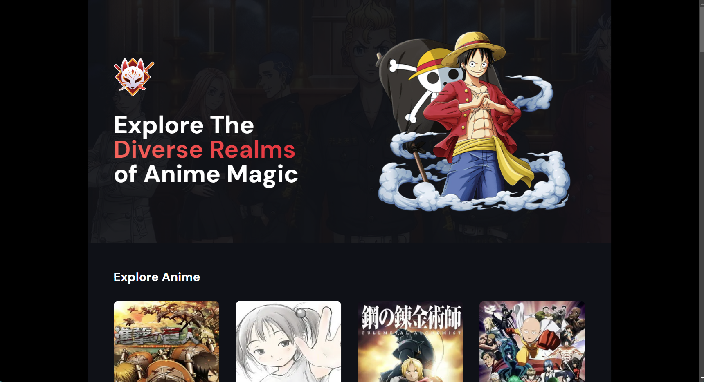

# Anime Vault

**Your favorite anime, all in one place!**

Anime Vault is the ultimate destination for anime enthusiasts, offering a centralized platform to explore your favorite anime series. This modern Next.js 14-based server-side application is a fusion of innovation and seamless user experience, featuring server actions, Framer Motion animations, and infinite scroll functionality.

## Features

- **Infinite Scroll:** Seamlessly scroll through an extensive collection of anime titles.
- **Server Actions:** Efficiently handle backend actions for optimized performance.
- **Framer Motion Animations:** Enhanced user experience with fluid and intuitive animations.
- **Data Source:** Fetches anime data from [Shikimori API](https://shikimori.one/api/doc/1.0/animes/index).

## Deployment and Source Code

The app is live at [Anime Vault](https://utkarsh-anime-vault.vercel.app/). Explore your favorite anime series effortlessly.

Find the project's source code at [GitHub Repository](https://github.com/UtkarshPathrabe/Anime-Vault).

## Technologies Used

- **Next.js 14:** Empowers server-side rendering and modern web functionalities.
- **Framer Motion:** Incorporates dynamic and interactive animations.
- **Infinite Loading:** Implements seamless scrolling for a better user experience.
- **TailwindCSS:** Facilitates rapid and responsive UI development.
- **TypeScript:** Ensures a robust, statically-typed codebase.

Discover, explore and immerse yourself in the captivating world of anime with Anime Vault! 🚀📺

